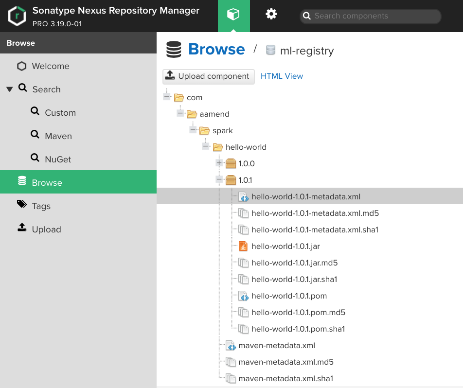

## Spark ML Governance package

Enabling continuous delivery and improvement of Spark pipeline models through devops methodology and ML governance.

[](https://maven-badges.herokuapp.com/maven-central/com.aamend.spark/spark-governance)
[](https://travis-ci.org/aamend/spark-governance)

## Principles

We enrich Spark ML framework to enable governance of machine learning models,
leveraging software delivery tools such as [apache maven](https://maven.apache.org/), [Ivy](http://ant.apache.org/ivy/) and [nexus](https://www.sonatype.com/product-nexus-repository). 

- Use `maven` to version a trained pipeline model and package binary as `.jar` file
- Use `nexus` as a central model registry to deploy immutable ML binaries
- Use `ivy` to load specific models to Spark context via `--packages` functionality

With a central repository for ML models, machine learning can be constantly retrained and re-injected
into your operation environment as reported in below HL workflow. 
One can operate data science under full governance where each
model is trusted, validated, registered, deployed and continuously improved.


Key concepts of this projects are explained below
- [Model Versioning](#model-versioning)
- [Model Registry](#model-registry)

Alternatively, jump to usage section
- [Pipeline Deployment](#deploy-pipeline)
- [Pipeline Resolution](#resolve-pipeline)
- [Pipeline Watermark](#versioned-pipeline)

### Model Versioning

We propose a naming convention for machine learning models borrowed from standard 
software delivery principles (see [docs](https://docs.oracle.com/middleware/1212/core/MAVEN/maven_version.htm)), in the form of

```
[groupId]:[artifactId]:[majorVersion].[minorVersion].[buildNumber]
```

- `groupId`: The name of your organisation, using reversed domain (e.g. `com.organisation`)
- `artifactId`: The name of your pipeline, agnostic from the modelling technique used (e.g. `customer-propensity`)
- `majorVersion`: The major version of your model. Specific to the technique and features used
- `minorVersion`: The minor version of your model. A specific configuration was used but technique remained the same (version increment should be backwards compatible)
- `buildNumber`: The build number that will be incremented automatically any time a same model is retrained using same configuration and same technique but with up to date data

An example of valid naming convention would be

    `com.organisation:customer-propensity:1.0.0`
    `com.organisation:customer-propensity:1.0.1`
    `com.organisation:customer-propensity:1.1.0`
    `com.organisation:customer-propensity:2.0.0`

The corresponding maven dependency can be added to java / scala based project using GAV (**G**roup **A**rtifact **V**ersion) coordinates

```xml
<dependency>
    <groupId>com.organisation</groupId>
    <artifactId>customer-propensity</artifactId>
    <version>2.0.0</version>
</dependency>
```

### Model Registry

We use Nexus as a central model registry.
Setting up Nexus is relatively easy and should already be de facto standard in your organisation. 
Project requires a `maven2` release repository to be created in order to host versioned pipeline models as per any standard Java dependency.


Note that we purposely did not enable `SNAPSHOT` feature of machine learning models as we consider each iteration 
of a model as an immutable release, hence with a different version build number.
 
To operate under full governance, it is advised to use multiple repositories (e.g. staging and prod) where only validated
models (e.g. validated through a QA process) can be promoted from one to another via Nexus [staging release process](https://help.sonatype.com/repomanager2/staging-releases)

## Usage

Available as a [spark package](https://spark-packages.org/package/aamend/spark-governance), include this package in your Spark Application as follows

```shell script
$ spark-shell --packages com.aamend.spark:spark-governance:latest.release
```

### Deploy Pipeline

Inspired by the scikit-learn project, spark ML relies on Pipeline to execute machine learning workflows at scale.
Spark stores binaries in a "crude" way by serializing model metadata to a given path (hdfs or s3).

```scala
val pipeline: Pipeline = new Pipeline().setStages(stages)
val model: PipelineModel = pipeline.fit(df)
model.save("/path/to/hdfs")
```

We propose the following changes

```scala
import com.aamend.spark.ml._
ModelRepository.deploy(model, "com.aamend.spark:hello-world:1.0")
```

This process will
 
- Serialize model to disk as per standard ML pipeline `save` function
- Package pipeline model as a `.jar` file 
- Work out the relevant build number for artifact `com.aamend.spark:hello-world` given a major and minor version
- Upload model `com.aamend.spark:hello-world:latest` to nexus

Nexus authentication is enabled by passing an `application.conf` to your spark context as follows

```shell script
$ spark-shell \
  --files application.conf \
  --driver-java-options -Dconfig.file=application.conf \
  --packages com.aamend.spark:spark-governance:latest.release
```

or adding `application.conf` in your project classpath. Configuration needs to contain the following information

```shell script
model {
    repository {
        id: "model-governance"
        url: "http://localhost:8081/repository/ml-repository/"
        username: "5gEa1ez2"
        password: "Rl5PpGxICA-vh8-cghkJoq3i3tWAmKJtqgOoYpZqhh-f"
    }
}
```

Note that we highly recommend enabling [User Tokens settings on Nexus](https://help.sonatype.com/repomanager3/security/security-setup-with-user-tokens#SecuritySetupwithUserTokens-EnablingandResettingUserTokens) 
to encrypt username / password. 

Alternatively, one can pass nexus credentials to `deploy` function explicitly

```scala
import com.aamend.spark.ml._
ModelRepository.deploy(
  model = model,
  gav = "com.aamend.spark:hello-world:1.0",
  repoId = "model-governance",
  repoURL = "http://localhost:8081/nexus/content/repositories/model-governance/",
  repoUsername = "5gEa1ez2",
  repoPassword = "Rl5PpGxICA-vh8-cghkJoq3i3tWAmKJtqgOoYpZqhh-f"
)
```

Resulting artifact will be released to Nexus and - as such - considered as immutable across multiple environments.



### Resolve Pipeline

Given that we consider each pipeline model as a standard maven dependency available on nexus, 
we can leverage Spark Ivy functionality (through `--packages`) to inject our model as a dependency to a spark context. 
Note that one needs to pass specific ivy settings to point to their internal Nexus repository. 
An example of `ivysettings.xml` can be found [here](examples/ivysettings.xml)

```shell script
$ spark-shell \
  --conf spark.jars.ivySettings=ivysettings.xml \
  --packages com.aamend.spark:hello-world:latest.release
```

By specifying `latest.release` instead of specific version, Ivy framework will ensure latest version of a 
model is resolved and loaded, paving the way to online machine learning. 
Under the hood, we read pipeline metadata from classpath, 
store binaries to disk and load pipeline model through native spark `load` function.

```scala
import com.aamend.spark.ml._
val model: PipelineModel = ModelRepository.resolve("com.aamend.spark:hello-world")
```

### Versioned Pipeline

In order to guarantee model reproducibility, we enabled a new type of pipeline `VersionedPipeline` that appends a 
schema with pipeline version as published to nexus.

```scala
import com.aamend.spark.ml._
val pipeline: Pipeline = new VersionedPipeline().setWatermarkCol("pipeline").setStages(stages)
val model: PipelineModel = pipeline.fit(df)
ModelRepository.deploy(model, "com.aamend.spark:hello-world:1.0")
```

For each record, we know the exact version of the model used, model available on nexus. 

```scala
import com.aamend.spark.ml._
val model: PipelineModel = ModelRepository.resolve("com.aamend.spark:hello-world")
model.transform(df).select("id", "pipeline").show()
```

```
+---+----------------------------------+
|id |pipeline                          |
+---+----------------------------------+
|4  |com.aamend.spark:hello-world:1.0.0|
|5  |com.aamend.spark:hello-world:1.0.0|
|6  |com.aamend.spark:hello-world:1.0.0|
|7  |com.aamend.spark:hello-world:1.0.0|
+---+----------------------------------+
```

Ideally, this extra information at a record level will serve for model monitoring. 
As a data scientist, you may want to be informed whenever performance of your model degrade so that you can
retrain a new model and deploy via the above methodology.

## Backlog

- serialize models using MLeap to be used outside of a spark context (e.g. Flink)
- extract data distribution from model input features to be stored on nexus as metadata

## Install

```shell script
mvn clean package
```

### Author

[Antoine Amend](mailto:antoine.amend@gmail.com)
